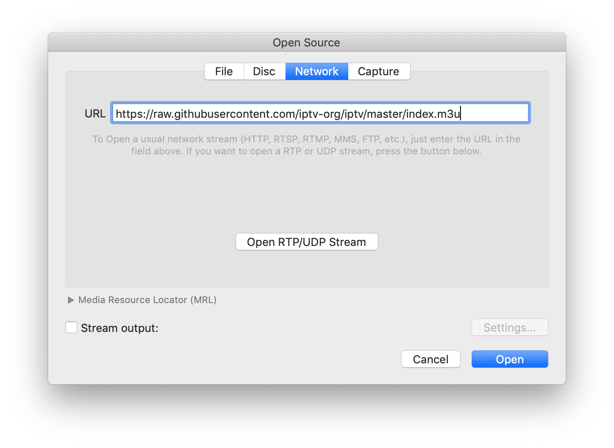

# IPTV

Collection of 8000+ publicly available IPTV channels from all over the world. 

Internet Protocol television (IPTV) is the delivery of television content over Internet Protocol (IP) networks. 

## Usage

To watch IPTV you just need to paste this link `https://iptv-org.github.io/iptv/index.m3u` to any player with support M3U-playlists.



Also you can instead use one of these playlists:

- `https://iptv-org.github.io/iptv/index.country.m3u` (grouped by country)
- `https://iptv-org.github.io/iptv/index.category.m3u` (grouped by category)
- `https://iptv-org.github.io/iptv/index.language.m3u` (grouped by language)

Or select one of the playlists from the list below.

## Playlists by category

<table>
	<thead>
		<tr><th align="left">Category</th><th align="right">Channels</th><th align="left">Playlist</th></tr>
	</thead>
	<tbody>
		<tr><td align="left">Auto</td><td align="right">2</td><td align="left"><code>https://iptv-org.github.io/iptv/categories/auto.m3u</code></td></tr>
		<tr><td align="left">Business</td><td align="right">33</td><td align="left"><code>https://iptv-org.github.io/iptv/categories/business.m3u</code></td></tr>
		<tr><td align="left">Comedy</td><td align="right">3</td><td align="left"><code>https://iptv-org.github.io/iptv/categories/comedy.m3u</code></td></tr>
		<tr><td align="left">Documentary</td><td align="right">17</td><td align="left"><code>https://iptv-org.github.io/iptv/categories/documentary.m3u</code></td></tr>
		<tr><td align="left">Education</td><td align="right">34</td><td align="left"><code>https://iptv-org.github.io/iptv/categories/education.m3u</code></td></tr>
		<tr><td align="left">Entertainment</td><td align="right">67</td><td align="left"><code>https://iptv-org.github.io/iptv/categories/entertainment.m3u</code></td></tr>
		<tr><td align="left">Family</td><td align="right">6</td><td align="left"><code>https://iptv-org.github.io/iptv/categories/family.m3u</code></td></tr>
		<tr><td align="left">Fashion</td><td align="right">21</td><td align="left"><code>https://iptv-org.github.io/iptv/categories/fashion.m3u</code></td></tr>
		<tr><td align="left">Food</td><td align="right">1</td><td align="left"><code>https://iptv-org.github.io/iptv/categories/food.m3u</code></td></tr>
		<tr><td align="left">General</td><td align="right">124</td><td align="left"><code>https://iptv-org.github.io/iptv/categories/general.m3u</code></td></tr>
		<tr><td align="left">Health</td><td align="right">2</td><td align="left"><code>https://iptv-org.github.io/iptv/categories/health.m3u</code></td></tr>
		<tr><td align="left">History</td><td align="right">3</td><td align="left"><code>https://iptv-org.github.io/iptv/categories/history.m3u</code></td></tr>
		<tr><td align="left">Hobby</td><td align="right">7</td><td align="left"><code>https://iptv-org.github.io/iptv/categories/hobby.m3u</code></td></tr>
		<tr><td align="left">Kids</td><td align="right">75</td><td align="left"><code>https://iptv-org.github.io/iptv/categories/kids.m3u</code></td></tr>
		<tr><td align="left">Legislative</td><td align="right">25</td><td align="left"><code>https://iptv-org.github.io/iptv/categories/legislative.m3u</code></td></tr>
		<tr><td align="left">Lifestyle</td><td align="right">4</td><td align="left"><code>https://iptv-org.github.io/iptv/categories/lifestyle.m3u</code></td></tr>
		<tr><td align="left">Local</td><td align="right">237</td><td align="left"><code>https://iptv-org.github.io/iptv/categories/local.m3u</code></td></tr>
		<tr><td align="left">Movies</td><td align="right">56</td><td align="left"><code>https://iptv-org.github.io/iptv/categories/movies.m3u</code></td></tr>
		<tr><td align="left">Music</td><td align="right">158</td><td align="left"><code>https://iptv-org.github.io/iptv/categories/music.m3u</code></td></tr>
		<tr><td align="left">News</td><td align="right">230</td><td align="left"><code>https://iptv-org.github.io/iptv/categories/news.m3u</code></td></tr>
		<tr><td align="left">Religious</td><td align="right">179</td><td align="left"><code>https://iptv-org.github.io/iptv/categories/religious.m3u</code></td></tr>
		<tr><td align="left">Shop</td><td align="right">30</td><td align="left"><code>https://iptv-org.github.io/iptv/categories/shop.m3u</code></td></tr>
		<tr><td align="left">Sport</td><td align="right">111</td><td align="left"><code>https://iptv-org.github.io/iptv/categories/sport.m3u</code></td></tr>
		<tr><td align="left">Travel</td><td align="right">8</td><td align="left"><code>https://iptv-org.github.io/iptv/categories/travel.m3u</code></td></tr>
		<tr><td align="left">Weather</td><td align="right">5</td><td align="left"><code>https://iptv-org.github.io/iptv/categories/weather.m3u</code></td></tr>
		<tr><td align="left">XXX</td><td align="right">45</td><td align="left"><code>https://iptv-org.github.io/iptv/categories/xxx.m3u</code></td></tr>
		<tr><td align="left">Other</td><td align="right">3021</td><td align="left"><code>https://iptv-org.github.io/iptv/categories/other.m3u</code></td></tr>
	</tbody>
</table>

## Playlists by language

<table>
	<thead>
		<tr><th align="left">Language</th><th align="right">Channels</th><th align="left">Playlist</th></tr>
	</thead>
	<tbody>
		<tr><td align="left">Akan</td><td align="right">2</td><td align="left"><code>https://iptv-org.github.io/iptv/languages/aka.m3u</code></td></tr>
		<tr><td align="left">Albanian</td><td align="right">22</td><td align="left"><code>https://iptv-org.github.io/iptv/languages/sqi.m3u</code></td></tr>
		<tr><td align="left">Amharic</td><td align="right">1</td><td align="left"><code>https://iptv-org.github.io/iptv/languages/amh.m3u</code></td></tr>
		<tr><td align="left">Arabic</td><td align="right">271</td><td align="left"><code>https://iptv-org.github.io/iptv/languages/ara.m3u</code></td></tr>
		<tr><td align="left">Armenian</td><td align="right">8</td><td align="left"><code>https://iptv-org.github.io/iptv/languages/hye.m3u</code></td></tr>
		<tr><td align="left">Azerbaijani</td><td align="right">12</td><td align="left"><code>https://iptv-org.github.io/iptv/languages/aze.m3u</code></td></tr>
		<tr><td align="left">Bengali</td><td align="right">5</td><td align="left"><code>https://iptv-org.github.io/iptv/languages/ben.m3u</code></td></tr>
		<tr><td align="left">Bosnian</td><td align="right">3</td><td align="left"><code>https://iptv-org.github.io/iptv/languages/bos.m3u</code></td></tr>
		<tr><td align="left">Bulgarian</td><td align="right">16</td><td align="left"><code>https://iptv-org.github.io/iptv/languages/bul.m3u</code></td></tr>
		<tr><td align="left">Burmese</td><td align="right">16</td><td align="left"><code>https://iptv-org.github.io/iptv/languages/mya.m3u</code></td></tr>
		<tr><td align="left">Catalan</td><td align="right">2</td><td align="left"><code>https://iptv-org.github.io/iptv/languages/cat.m3u</code></td></tr>
		<tr><td align="left">Chinese</td><td align="right">1102</td><td align="left"><code>https://iptv-org.github.io/iptv/languages/zho.m3u</code></td></tr>
		<tr><td align="left">Croatian</td><td align="right">14</td><td align="left"><code>https://iptv-org.github.io/iptv/languages/hrv.m3u</code></td></tr>
		<tr><td align="left">Czech</td><td align="right">18</td><td align="left"><code>https://iptv-org.github.io/iptv/languages/ces.m3u</code></td></tr>
		<tr><td align="left">Danish</td><td align="right">14</td><td align="left"><code>https://iptv-org.github.io/iptv/languages/dan.m3u</code></td></tr>
		<tr><td align="left">Dutch</td><td align="right">66</td><td align="left"><code>https://iptv-org.github.io/iptv/languages/nld.m3u</code></td></tr>
		<tr><td align="left">English</td><td align="right">562</td><td align="left"><code>https://iptv-org.github.io/iptv/languages/eng.m3u</code></td></tr>
		<tr><td align="left">Estonian</td><td align="right">3</td><td align="left"><code>https://iptv-org.github.io/iptv/languages/est.m3u</code></td></tr>
		<tr><td align="left">Faroese</td><td align="right">1</td><td align="left"><code>https://iptv-org.github.io/iptv/languages/fao.m3u</code></td></tr>
		<tr><td align="left">Finnish</td><td align="right">3</td><td align="left"><code>https://iptv-org.github.io/iptv/languages/fin.m3u</code></td></tr>
		<tr><td align="left">French</td><td align="right">80</td><td align="left"><code>https://iptv-org.github.io/iptv/languages/fra.m3u</code></td></tr>
		<tr><td align="left">Galician</td><td align="right">2</td><td align="left"><code>https://iptv-org.github.io/iptv/languages/glg.m3u</code></td></tr>
		<tr><td align="left">Georgian</td><td align="right">41</td><td align="left"><code>https://iptv-org.github.io/iptv/languages/kat.m3u</code></td></tr>
		<tr><td align="left">German</td><td align="right">192</td><td align="left"><code>https://iptv-org.github.io/iptv/languages/deu.m3u</code></td></tr>
		<tr><td align="left">Hebrew</td><td align="right">15</td><td align="left"><code>https://iptv-org.github.io/iptv/languages/heb.m3u</code></td></tr>
		<tr><td align="left">Hindi</td><td align="right">131</td><td align="left"><code>https://iptv-org.github.io/iptv/languages/hin.m3u</code></td></tr>
		<tr><td align="left">Hungarian</td><td align="right">18</td><td align="left"><code>https://iptv-org.github.io/iptv/languages/hun.m3u</code></td></tr>
		<tr><td align="left">Icelandic</td><td align="right">3</td><td align="left"><code>https://iptv-org.github.io/iptv/languages/isl.m3u</code></td></tr>
		<tr><td align="left">Indonesian</td><td align="right">47</td><td align="left"><code>https://iptv-org.github.io/iptv/languages/ind.m3u</code></td></tr>
		<tr><td align="left">Italian</td><td align="right">142</td><td align="left"><code>https://iptv-org.github.io/iptv/languages/ita.m3u</code></td></tr>
		<tr><td align="left">Japanese</td><td align="right">15</td><td align="left"><code>https://iptv-org.github.io/iptv/languages/jpn.m3u</code></td></tr>
		<tr><td align="left">Javanese</td><td align="right">3</td><td align="left"><code>https://iptv-org.github.io/iptv/languages/jav.m3u</code></td></tr>
		<tr><td align="left">Kazakh</td><td align="right">21</td><td align="left"><code>https://iptv-org.github.io/iptv/languages/kaz.m3u</code></td></tr>
		<tr><td align="left">Khmer</td><td align="right">6</td><td align="left"><code>https://iptv-org.github.io/iptv/languages/khm.m3u</code></td></tr>
		<tr><td align="left">Kinyarwanda</td><td align="right">5</td><td align="left"><code>https://iptv-org.github.io/iptv/languages/kin.m3u</code></td></tr>
		<tr><td align="left">Korean</td><td align="right">31</td><td align="left"><code>https://iptv-org.github.io/iptv/languages/kor.m3u</code></td></tr>
		<tr><td align="left">Kurdish</td><td align="right">6</td><td align="left"><code>https://iptv-org.github.io/iptv/languages/kur.m3u</code></td></tr>
		<tr><td align="left">Lao</td><td align="right">4</td><td align="left"><code>https://iptv-org.github.io/iptv/languages/lao.m3u</code></td></tr>
		<tr><td align="left">Latvian</td><td align="right">4</td><td align="left"><code>https://iptv-org.github.io/iptv/languages/lav.m3u</code></td></tr>
		<tr><td align="left">Luxembourgish</td><td align="right">2</td><td align="left"><code>https://iptv-org.github.io/iptv/languages/ltz.m3u</code></td></tr>
		<tr><td align="left">Macedonian</td><td align="right">5</td><td align="left"><code>https://iptv-org.github.io/iptv/languages/mkd.m3u</code></td></tr>
		<tr><td align="left">Mandarin Chinese</td><td align="right">176</td><td align="left"><code>https://iptv-org.github.io/iptv/languages/cmn.m3u</code></td></tr>
		<tr><td align="left">Min Nan Chinese</td><td align="right">2</td><td align="left"><code>https://iptv-org.github.io/iptv/languages/nan.m3u</code></td></tr>
		<tr><td align="left">Mongolian</td><td align="right">6</td><td align="left"><code>https://iptv-org.github.io/iptv/languages/mon.m3u</code></td></tr>
		<tr><td align="left">Norwegian Bokmål</td><td align="right">2</td><td align="left"><code>https://iptv-org.github.io/iptv/languages/nob.m3u</code></td></tr>
		<tr><td align="left">Persian</td><td align="right">86</td><td align="left"><code>https://iptv-org.github.io/iptv/languages/fas.m3u</code></td></tr>
		<tr><td align="left">Polish</td><td align="right">9</td><td align="left"><code>https://iptv-org.github.io/iptv/languages/pol.m3u</code></td></tr>
		<tr><td align="left">Portuguese</td><td align="right">152</td><td align="left"><code>https://iptv-org.github.io/iptv/languages/por.m3u</code></td></tr>
		<tr><td align="left">Pushto</td><td align="right">6</td><td align="left"><code>https://iptv-org.github.io/iptv/languages/pus.m3u</code></td></tr>
		<tr><td align="left">Romanian</td><td align="right">89</td><td align="left"><code>https://iptv-org.github.io/iptv/languages/ron.m3u</code></td></tr>
		<tr><td align="left">Russian</td><td align="right">251</td><td align="left"><code>https://iptv-org.github.io/iptv/languages/rus.m3u</code></td></tr>
		<tr><td align="left">Serbian</td><td align="right">12</td><td align="left"><code>https://iptv-org.github.io/iptv/languages/srp.m3u</code></td></tr>
		<tr><td align="left">Sinhala</td><td align="right">4</td><td align="left"><code>https://iptv-org.github.io/iptv/languages/sin.m3u</code></td></tr>
		<tr><td align="left">Slovak</td><td align="right">34</td><td align="left"><code>https://iptv-org.github.io/iptv/languages/slk.m3u</code></td></tr>
		<tr><td align="left">Somali</td><td align="right">1</td><td align="left"><code>https://iptv-org.github.io/iptv/languages/som.m3u</code></td></tr>
		<tr><td align="left">Spanish</td><td align="right">342</td><td align="left"><code>https://iptv-org.github.io/iptv/languages/spa.m3u</code></td></tr>
		<tr><td align="left">Swedish</td><td align="right">11</td><td align="left"><code>https://iptv-org.github.io/iptv/languages/swe.m3u</code></td></tr>
		<tr><td align="left">Tagalog</td><td align="right">9</td><td align="left"><code>https://iptv-org.github.io/iptv/languages/tgl.m3u</code></td></tr>
		<tr><td align="left">Tamil</td><td align="right">15</td><td align="left"><code>https://iptv-org.github.io/iptv/languages/tam.m3u</code></td></tr>
		<tr><td align="left">Thai</td><td align="right">44</td><td align="left"><code>https://iptv-org.github.io/iptv/languages/tha.m3u</code></td></tr>
		<tr><td align="left">Turkish</td><td align="right">69</td><td align="left"><code>https://iptv-org.github.io/iptv/languages/tur.m3u</code></td></tr>
		<tr><td align="left">Turkmen</td><td align="right">11</td><td align="left"><code>https://iptv-org.github.io/iptv/languages/tuk.m3u</code></td></tr>
		<tr><td align="left">Ukrainian</td><td align="right">159</td><td align="left"><code>https://iptv-org.github.io/iptv/languages/ukr.m3u</code></td></tr>
		<tr><td align="left">Urdu</td><td align="right">23</td><td align="left"><code>https://iptv-org.github.io/iptv/languages/urd.m3u</code></td></tr>
		<tr><td align="left">Vietnamese</td><td align="right">67</td><td align="left"><code>https://iptv-org.github.io/iptv/languages/vie.m3u</code></td></tr>
		<tr><td align="left">Yue Chinese</td><td align="right">13</td><td align="left"><code>https://iptv-org.github.io/iptv/languages/yue.m3u</code></td></tr>
		<tr><td align="left">Undefined</td><td align="right">191</td><td align="left"><code>https://iptv-org.github.io/iptv/languages/undefined.m3u</code></td></tr>
	</tbody>
</table>

## Playlists by country

<table>
	<thead>
		<tr><th align="left">Country</th><th align="right">Channels</th><th align="left">Playlist</th><th align="left">EPG</th></tr>
	</thead>
	<tbody>
		<tr><td align="left">🇦🇫&nbsp;Afghanistan</td><td align="right">6</td><td align="left" nowrap><code>https://iptv-org.github.io/iptv/countries/af.m3u</code></td><td align="left"></td></tr>
		<tr><td align="left">🇦🇱&nbsp;Albania</td><td align="right">15</td><td align="left" nowrap><code>https://iptv-org.github.io/iptv/countries/al.m3u</code></td><td align="left"></td></tr>
		<tr><td align="left">🇩🇿&nbsp;Algeria</td><td align="right">2</td><td align="left" nowrap><code>https://iptv-org.github.io/iptv/countries/dz.m3u</code></td><td align="left"></td></tr>
		<tr><td align="left">🇦🇩&nbsp;Andorra</td><td align="right">2</td><td align="left" nowrap><code>https://iptv-org.github.io/iptv/countries/ad.m3u</code></td><td align="left"></td></tr>
		<tr><td align="left">🇦🇴&nbsp;Angola</td><td align="right">1</td><td align="left" nowrap><code>https://iptv-org.github.io/iptv/countries/ao.m3u</code></td><td align="left"></td></tr>
		<tr><td align="left">🇦🇷&nbsp;Argentina</td><td align="right">46</td><td align="left" nowrap><code>https://iptv-org.github.io/iptv/countries/ar.m3u</code></td><td align="left"></td></tr>
		<tr><td align="left">🇦🇲&nbsp;Armenia</td><td align="right">8</td><td align="left" nowrap><code>https://iptv-org.github.io/iptv/countries/am.m3u</code></td><td align="left"></td></tr>
		<tr><td align="left">🇦🇼&nbsp;Aruba</td><td align="right">3</td><td align="left" nowrap><code>https://iptv-org.github.io/iptv/countries/aw.m3u</code></td><td align="left"></td></tr>
		<tr><td align="left">🇦🇺&nbsp;Australia</td><td align="right">15</td><td align="left" nowrap><code>https://iptv-org.github.io/iptv/countries/au.m3u</code></td><td align="left"><code>http://i.mjh.nz/nzau/epg.xml.gz</code></td></tr>
		<tr><td align="left">🇦🇹&nbsp;Austria</td><td align="right">16</td><td align="left" nowrap><code>https://iptv-org.github.io/iptv/countries/at.m3u</code></td><td align="left"><code>http://epg.streamstv.me/epg/guide-austria.xml.gz</code></td></tr>
		<tr><td align="left">🇦🇿&nbsp;Azerbaijan</td><td align="right">11</td><td align="left" nowrap><code>https://iptv-org.github.io/iptv/countries/az.m3u</code></td><td align="left"><code>https://iptvx.one/epg/epg.xml.gz</code></td></tr>
		<tr><td align="left">🇧🇭&nbsp;Bahrain</td><td align="right">8</td><td align="left" nowrap><code>https://iptv-org.github.io/iptv/countries/bh.m3u</code></td><td align="left"></td></tr>
		<tr><td align="left">🇧🇩&nbsp;Bangladesh</td><td align="right">5</td><td align="left" nowrap><code>https://iptv-org.github.io/iptv/countries/bd.m3u</code></td><td align="left"></td></tr>
		<tr><td align="left">🇧🇧&nbsp;Barbados</td><td align="right">1</td><td align="left" nowrap><code>https://iptv-org.github.io/iptv/countries/bb.m3u</code></td><td align="left"></td></tr>
		<tr><td align="left">🇧🇾&nbsp;Belarus</td><td align="right">11</td><td align="left" nowrap><code>https://iptv-org.github.io/iptv/countries/by.m3u</code></td><td align="left"><code>https://iptvx.one/epg/epg.xml.gz</code></td></tr>
		<tr><td align="left">🇧🇪&nbsp;Belgium</td><td align="right">24</td><td align="left" nowrap><code>https://iptv-org.github.io/iptv/countries/be.m3u</code></td><td align="left"></td></tr>
		<tr><td align="left">🇧🇴&nbsp;Bolivia</td><td align="right">10</td><td align="left" nowrap><code>https://iptv-org.github.io/iptv/countries/bo.m3u</code></td><td align="left"></td></tr>
		<tr><td align="left">🇧🇦&nbsp;Bosnia and Herzegovina</td><td align="right">3</td><td align="left" nowrap><code>https://iptv-org.github.io/iptv/countries/ba.m3u</code></td><td align="left"><code>http://epg.streamstv.me/epg/guide-exyu.xml.gz</code></td></tr>
		<tr><td align="left">🇧🇷&nbsp;Brazil</td><td align="right">123</td><td align="left" nowrap><code>https://iptv-org.github.io/iptv/countries/br.m3u</code></td><td align="left"></td></tr>
		<tr><td align="left">🇧🇳&nbsp;Brunei</td><td align="right">3</td><td align="left" nowrap><code>https://iptv-org.github.io/iptv/countries/bn.m3u</code></td><td align="left"></td></tr>
		<tr><td align="left">🇧🇬&nbsp;Bulgaria</td><td align="right">16</td><td align="left" nowrap><code>https://iptv-org.github.io/iptv/countries/bg.m3u</code></td><td align="left"></td></tr>
		<tr><td align="left">🇧🇫&nbsp;Burkina Faso</td><td align="right">1</td><td align="left" nowrap><code>https://iptv-org.github.io/iptv/countries/bf.m3u</code></td><td align="left"></td></tr>
		<tr><td align="left">🇰🇭&nbsp;Cambodia</td><td align="right">6</td><td align="left" nowrap><code>https://iptv-org.github.io/iptv/countries/kh.m3u</code></td><td align="left"></td></tr>
		<tr><td align="left">🇨🇲&nbsp;Cameroon</td><td align="right">5</td><td align="left" nowrap><code>https://iptv-org.github.io/iptv/countries/cm.m3u</code></td><td align="left"></td></tr>
		<tr><td align="left">🇨🇦&nbsp;Canada</td><td align="right">30</td><td align="left" nowrap><code>https://iptv-org.github.io/iptv/countries/ca.m3u</code></td><td align="left"><code>http://epg.streamstv.me/epg/guide-canada.xml.gz</code></td></tr>
		<tr><td align="left">🇨🇱&nbsp;Chile</td><td align="right">39</td><td align="left" nowrap><code>https://iptv-org.github.io/iptv/countries/cl.m3u</code></td><td align="left"></td></tr>
		<tr><td align="left">🇨🇳&nbsp;China</td><td align="right">1015</td><td align="left" nowrap><code>https://iptv-org.github.io/iptv/countries/cn.m3u</code></td><td align="left"><code>http://epg.51zmt.top:8000/e.xml.gz</code></td></tr>
		<tr><td align="left">🇨🇴&nbsp;Colombia</td><td align="right">20</td><td align="left" nowrap><code>https://iptv-org.github.io/iptv/countries/co.m3u</code></td><td align="left"></td></tr>
		<tr><td align="left">🇨🇷&nbsp;Costa Rica</td><td align="right">9</td><td align="left" nowrap><code>https://iptv-org.github.io/iptv/countries/cr.m3u</code></td><td align="left"></td></tr>
		<tr><td align="left">🇭🇷&nbsp;Croatia</td><td align="right">14</td><td align="left" nowrap><code>https://iptv-org.github.io/iptv/countries/hr.m3u</code></td><td align="left"><code>http://tvprofil.net/xmltv/data/epg_tvprofil.net.xml</code></td></tr>
		<tr><td align="left">🇨🇼&nbsp;Curaçao</td><td align="right">3</td><td align="left" nowrap><code>https://iptv-org.github.io/iptv/countries/cw.m3u</code></td><td align="left"></td></tr>
		<tr><td align="left">🇨🇾&nbsp;Cyprus</td><td align="right">14</td><td align="left" nowrap><code>https://iptv-org.github.io/iptv/countries/cy.m3u</code></td><td align="left"></td></tr>
		<tr><td align="left">🇨🇿&nbsp;Czech Republic</td><td align="right">18</td><td align="left" nowrap><code>https://iptv-org.github.io/iptv/countries/cz.m3u</code></td><td align="left"><code>http://epg.streamstv.me/epg/guide-cz.xml.gz</code></td></tr>
		<tr><td align="left">🇨🇩&nbsp;Democratic Republic of the Congo</td><td align="right">1</td><td align="left" nowrap><code>https://iptv-org.github.io/iptv/countries/cd.m3u</code></td><td align="left"></td></tr>
		<tr><td align="left">🇩🇰&nbsp;Denmark</td><td align="right">14</td><td align="left" nowrap><code>https://iptv-org.github.io/iptv/countries/dk.m3u</code></td><td align="left"></td></tr>
		<tr><td align="left">🇩🇴&nbsp;Dominican Republic</td><td align="right">25</td><td align="left" nowrap><code>https://iptv-org.github.io/iptv/countries/do.m3u</code></td><td align="left"></td></tr>
		<tr><td align="left">🇪🇨&nbsp;Ecuador</td><td align="right">8</td><td align="left" nowrap><code>https://iptv-org.github.io/iptv/countries/ec.m3u</code></td><td align="left"></td></tr>
		<tr><td align="left">🇪🇬&nbsp;Egypt</td><td align="right">8</td><td align="left" nowrap><code>https://iptv-org.github.io/iptv/countries/eg.m3u</code></td><td align="left"></td></tr>
		<tr><td align="left">🇸🇻&nbsp;El Salvador</td><td align="right">2</td><td align="left" nowrap><code>https://iptv-org.github.io/iptv/countries/sv.m3u</code></td><td align="left"></td></tr>
		<tr><td align="left">🇬🇶&nbsp;Equatorial Guinea</td><td align="right">1</td><td align="left" nowrap><code>https://iptv-org.github.io/iptv/countries/gq.m3u</code></td><td align="left"></td></tr>
		<tr><td align="left">🇪🇪&nbsp;Estonia</td><td align="right">3</td><td align="left" nowrap><code>https://iptv-org.github.io/iptv/countries/ee.m3u</code></td><td align="left"></td></tr>
		<tr><td align="left">🇪🇹&nbsp;Ethiopia</td><td align="right">1</td><td align="left" nowrap><code>https://iptv-org.github.io/iptv/countries/et.m3u</code></td><td align="left"></td></tr>
		<tr><td align="left">🇫🇴&nbsp;Faroe Islands</td><td align="right">1</td><td align="left" nowrap><code>https://iptv-org.github.io/iptv/countries/fo.m3u</code></td><td align="left"></td></tr>
		<tr><td align="left">🇫🇮&nbsp;Finland</td><td align="right">3</td><td align="left" nowrap><code>https://iptv-org.github.io/iptv/countries/fi.m3u</code></td><td align="left"></td></tr>
		<tr><td align="left">🇫🇯&nbsp;Fiji</td><td align="right">1</td><td align="left" nowrap><code>https://iptv-org.github.io/iptv/countries/fj.m3u</code></td><td align="left"></td></tr>
		<tr><td align="left">🇫🇷&nbsp;France</td><td align="right">59</td><td align="left" nowrap><code>https://iptv-org.github.io/iptv/countries/fr.m3u</code></td><td align="left"></td></tr>
		<tr><td align="left">🇬🇲&nbsp;Gambia</td><td align="right">1</td><td align="left" nowrap><code>https://iptv-org.github.io/iptv/countries/gm.m3u</code></td><td align="left"></td></tr>
		<tr><td align="left">🇬🇪&nbsp;Georgia</td><td align="right">41</td><td align="left" nowrap><code>https://iptv-org.github.io/iptv/countries/ge.m3u</code></td><td align="left"></td></tr>
		<tr><td align="left">🇩🇪&nbsp;Germany</td><td align="right">160</td><td align="left" nowrap><code>https://iptv-org.github.io/iptv/countries/de.m3u</code></td><td align="left"></td></tr>
		<tr><td align="left">🇬🇭&nbsp;Ghana</td><td align="right">3</td><td align="left" nowrap><code>https://iptv-org.github.io/iptv/countries/gh.m3u</code></td><td align="left"></td></tr>
		<tr><td align="left">🇬🇷&nbsp;Greece</td><td align="right">55</td><td align="left" nowrap><code>https://iptv-org.github.io/iptv/countries/gr.m3u</code></td><td align="left"></td></tr>
		<tr><td align="left">🇬🇵&nbsp;Guadeloupe</td><td align="right">1</td><td align="left" nowrap><code>https://iptv-org.github.io/iptv/countries/gp.m3u</code></td><td align="left"></td></tr>
		<tr><td align="left">🇬🇾&nbsp;Guyana</td><td align="right">2</td><td align="left" nowrap><code>https://iptv-org.github.io/iptv/countries/gy.m3u</code></td><td align="left"></td></tr>
		<tr><td align="left">🇭🇹&nbsp;Haiti</td><td align="right">8</td><td align="left" nowrap><code>https://iptv-org.github.io/iptv/countries/ht.m3u</code></td><td align="left"></td></tr>
		<tr><td align="left">🇭🇳&nbsp;Honduras</td><td align="right">17</td><td align="left" nowrap><code>https://iptv-org.github.io/iptv/countries/hn.m3u</code></td><td align="left"></td></tr>
		<tr><td align="left">🇭🇰&nbsp;Hong Kong</td><td align="right">20</td><td align="left" nowrap><code>https://iptv-org.github.io/iptv/countries/hk.m3u</code></td><td align="left"></td></tr>
		<tr><td align="left">🇭🇺&nbsp;Hungary</td><td align="right">18</td><td align="left" nowrap><code>https://iptv-org.github.io/iptv/countries/hu.m3u</code></td><td align="left"><code>http://epg.streamstv.me/epg/guide-hungry.xml.gz</code></td></tr>
		<tr><td align="left">🇮🇸&nbsp;Iceland</td><td align="right">3</td><td align="left" nowrap><code>https://iptv-org.github.io/iptv/countries/is.m3u</code></td><td align="left"></td></tr>
		<tr><td align="left">🇮🇳&nbsp;India</td><td align="right">153</td><td align="left" nowrap><code>https://iptv-org.github.io/iptv/countries/in.m3u</code></td><td align="left"><code>http://epg.streamstv.me/epg/guide-india.xml.gz</code></td></tr>
		<tr><td align="left">🇮🇩&nbsp;Indonesia</td><td align="right">51</td><td align="left" nowrap><code>https://iptv-org.github.io/iptv/countries/id.m3u</code></td><td align="left"></td></tr>
		<tr><td align="left">🌎&nbsp;International</td><td align="right">75</td><td align="left" nowrap><code>https://iptv-org.github.io/iptv/countries/int.m3u</code></td><td align="left"></td></tr>
		<tr><td align="left">🇮🇷&nbsp;Iran</td><td align="right">90</td><td align="left" nowrap><code>https://iptv-org.github.io/iptv/countries/ir.m3u</code></td><td align="left"></td></tr>
		<tr><td align="left">🇮🇶&nbsp;Iraq</td><td align="right">33</td><td align="left" nowrap><code>https://iptv-org.github.io/iptv/countries/iq.m3u</code></td><td align="left"></td></tr>
		<tr><td align="left">🇮🇪&nbsp;Ireland</td><td align="right">3</td><td align="left" nowrap><code>https://iptv-org.github.io/iptv/countries/ie.m3u</code></td><td align="left"></td></tr>
		<tr><td align="left">🇮🇱&nbsp;Israel</td><td align="right">17</td><td align="left" nowrap><code>https://iptv-org.github.io/iptv/countries/il.m3u</code></td><td align="left"><code>http://epg.streamstv.me/epg/guide-israel.xml.gz</code></td></tr>
		<tr><td align="left">🇮🇹&nbsp;Italy</td><td align="right">142</td><td align="left" nowrap><code>https://iptv-org.github.io/iptv/countries/it.m3u</code></td><td align="left"></td></tr>
		<tr><td align="left">🇨🇮&nbsp;Ivory Coast</td><td align="right">3</td><td align="left" nowrap><code>https://iptv-org.github.io/iptv/countries/ci.m3u</code></td><td align="left"></td></tr>
		<tr><td align="left">🇯🇲&nbsp;Jamaica</td><td align="right">2</td><td align="left" nowrap><code>https://iptv-org.github.io/iptv/countries/jm.m3u</code></td><td align="left"></td></tr>
		<tr><td align="left">🇯🇵&nbsp;Japan</td><td align="right">15</td><td align="left" nowrap><code>https://iptv-org.github.io/iptv/countries/jp.m3u</code></td><td align="left"></td></tr>
		<tr><td align="left">🇯🇴&nbsp;Jordan</td><td align="right">7</td><td align="left" nowrap><code>https://iptv-org.github.io/iptv/countries/jo.m3u</code></td><td align="left"></td></tr>
		<tr><td align="left">🇰🇿&nbsp;Kazakhstan</td><td align="right">24</td><td align="left" nowrap><code>https://iptv-org.github.io/iptv/countries/kz.m3u</code></td><td align="left"><code>https://iptvx.one/epg/epg.xml.gz</code></td></tr>
		<tr><td align="left">🇰🇪&nbsp;Kenya</td><td align="right">2</td><td align="left" nowrap><code>https://iptv-org.github.io/iptv/countries/ke.m3u</code></td><td align="left"></td></tr>
		<tr><td align="left">🇽🇰&nbsp;Kosovo</td><td align="right">10</td><td align="left" nowrap><code>https://iptv-org.github.io/iptv/countries/xk.m3u</code></td><td align="left"></td></tr>
		<tr><td align="left">🇰🇼&nbsp;Kuwait</td><td align="right">12</td><td align="left" nowrap><code>https://iptv-org.github.io/iptv/countries/kw.m3u</code></td><td align="left"></td></tr>
		<tr><td align="left">🇰🇬&nbsp;Kyrgyzstan</td><td align="right">8</td><td align="left" nowrap><code>https://iptv-org.github.io/iptv/countries/kg.m3u</code></td><td align="left"></td></tr>
		<tr><td align="left">🇱🇦&nbsp;Laos</td><td align="right">4</td><td align="left" nowrap><code>https://iptv-org.github.io/iptv/countries/la.m3u</code></td><td align="left"></td></tr>
		<tr><td align="left">🇱🇻&nbsp;Latvia</td><td align="right">4</td><td align="left" nowrap><code>https://iptv-org.github.io/iptv/countries/lv.m3u</code></td><td align="left"><code>https://iptvx.one/epg/epg.xml.gz</code></td></tr>
		<tr><td align="left">🇱🇧&nbsp;Lebanon</td><td align="right">18</td><td align="left" nowrap><code>https://iptv-org.github.io/iptv/countries/lb.m3u</code></td><td align="left"></td></tr>
		<tr><td align="left">🇱🇾&nbsp;Libya</td><td align="right">8</td><td align="left" nowrap><code>https://iptv-org.github.io/iptv/countries/ly.m3u</code></td><td align="left"></td></tr>
		<tr><td align="left">🇱🇮&nbsp;Liechtenstein</td><td align="right">2</td><td align="left" nowrap><code>https://iptv-org.github.io/iptv/countries/li.m3u</code></td><td align="left"></td></tr>
		<tr><td align="left">🇱🇹&nbsp;Lithuania</td><td align="right">1</td><td align="left" nowrap><code>https://iptv-org.github.io/iptv/countries/lt.m3u</code></td><td align="left"><code>https://iptvx.one/epg/epg.xml.gz</code></td></tr>
		<tr><td align="left">🇱🇺&nbsp;Luxembourg</td><td align="right">2</td><td align="left" nowrap><code>https://iptv-org.github.io/iptv/countries/lu.m3u</code></td><td align="left"></td></tr>
		<tr><td align="left">🇲🇴&nbsp;Macau</td><td align="right">5</td><td align="left" nowrap><code>https://iptv-org.github.io/iptv/countries/mo.m3u</code></td><td align="left"></td></tr>
		<tr><td align="left">🇲🇾&nbsp;Malaysia</td><td align="right">21</td><td align="left" nowrap><code>https://iptv-org.github.io/iptv/countries/my.m3u</code></td><td align="left"><code>https://freeview.github.io/iptv/epg/tv.xml</code></td></tr>
		<tr><td align="left">🇲🇹&nbsp;Malta</td><td align="right">1</td><td align="left" nowrap><code>https://iptv-org.github.io/iptv/countries/mt.m3u</code></td><td align="left"><code>http://epg.streamstv.me/epg/guide-malta.xml.gz</code></td></tr>
		<tr><td align="left">🇲🇽&nbsp;Mexico</td><td align="right">34</td><td align="left" nowrap><code>https://iptv-org.github.io/iptv/countries/mx.m3u</code></td><td align="left"></td></tr>
		<tr><td align="left">🇲🇩&nbsp;Moldova</td><td align="right">15</td><td align="left" nowrap><code>https://iptv-org.github.io/iptv/countries/md.m3u</code></td><td align="left"><code>https://iptvx.one/epg/epg.xml.gz</code></td></tr>
		<tr><td align="left">🇲🇳&nbsp;Mongolia</td><td align="right">6</td><td align="left" nowrap><code>https://iptv-org.github.io/iptv/countries/mn.m3u</code></td><td align="left"></td></tr>
		<tr><td align="left">🇲🇪&nbsp;Montenegro</td><td align="right">4</td><td align="left" nowrap><code>https://iptv-org.github.io/iptv/countries/me.m3u</code></td><td align="left"></td></tr>
		<tr><td align="left">🇲🇦&nbsp;Morocco</td><td align="right">19</td><td align="left" nowrap><code>https://iptv-org.github.io/iptv/countries/ma.m3u</code></td><td align="left"></td></tr>
		<tr><td align="left">🇲🇿&nbsp;Mozambique</td><td align="right">4</td><td align="left" nowrap><code>https://iptv-org.github.io/iptv/countries/mz.m3u</code></td><td align="left"></td></tr>
		<tr><td align="left">🇲🇲&nbsp;Myanmar</td><td align="right">17</td><td align="left" nowrap><code>https://iptv-org.github.io/iptv/countries/mm.m3u</code></td><td align="left"></td></tr>
		<tr><td align="left">🇳🇵&nbsp;Nepal</td><td align="right">8</td><td align="left" nowrap><code>https://iptv-org.github.io/iptv/countries/np.m3u</code></td><td align="left"></td></tr>
		<tr><td align="left">🇳🇱&nbsp;Netherlands</td><td align="right">57</td><td align="left" nowrap><code>https://iptv-org.github.io/iptv/countries/nl.m3u</code></td><td align="left"></td></tr>
		<tr><td align="left">🇳🇿&nbsp;New Zealand</td><td align="right">8</td><td align="left" nowrap><code>https://iptv-org.github.io/iptv/countries/nz.m3u</code></td><td align="left"><code>http://i.mjh.nz/nzau/epg.xml.gz</code></td></tr>
		<tr><td align="left">🇳🇮&nbsp;Nicaragua</td><td align="right">2</td><td align="left" nowrap><code>https://iptv-org.github.io/iptv/countries/ni.m3u</code></td><td align="left"></td></tr>
		<tr><td align="left">🇳🇬&nbsp;Nigeria</td><td align="right">3</td><td align="left" nowrap><code>https://iptv-org.github.io/iptv/countries/ng.m3u</code></td><td align="left"></td></tr>
		<tr><td align="left">🇰🇵&nbsp;North Korea</td><td align="right">1</td><td align="left" nowrap><code>https://iptv-org.github.io/iptv/countries/kp.m3u</code></td><td align="left"></td></tr>
		<tr><td align="left">🇲🇰&nbsp;North Macedonia</td><td align="right">10</td><td align="left" nowrap><code>https://iptv-org.github.io/iptv/countries/mk.m3u</code></td><td align="left"></td></tr>
		<tr><td align="left">🇳🇴&nbsp;Norway</td><td align="right">3</td><td align="left" nowrap><code>https://iptv-org.github.io/iptv/countries/no.m3u</code></td><td align="left"><code>http://epg.streamstv.me/epg/guide-norway.xml.gz</code></td></tr>
		<tr><td align="left">🇴🇲&nbsp;Oman</td><td align="right">5</td><td align="left" nowrap><code>https://iptv-org.github.io/iptv/countries/om.m3u</code></td><td align="left"></td></tr>
		<tr><td align="left">🇵🇰&nbsp;Pakistan</td><td align="right">43</td><td align="left" nowrap><code>https://iptv-org.github.io/iptv/countries/pk.m3u</code></td><td align="left"></td></tr>
		<tr><td align="left">🇵🇸&nbsp;Palestine</td><td align="right">11</td><td align="left" nowrap><code>https://iptv-org.github.io/iptv/countries/ps.m3u</code></td><td align="left"></td></tr>
		<tr><td align="left">🇵🇦&nbsp;Panama</td><td align="right">4</td><td align="left" nowrap><code>https://iptv-org.github.io/iptv/countries/pa.m3u</code></td><td align="left"></td></tr>
		<tr><td align="left">🇵🇾&nbsp;Paraguay</td><td align="right">2</td><td align="left" nowrap><code>https://iptv-org.github.io/iptv/countries/py.m3u</code></td><td align="left"></td></tr>
		<tr><td align="left">🇵🇪&nbsp;Peru</td><td align="right">20</td><td align="left" nowrap><code>https://iptv-org.github.io/iptv/countries/pe.m3u</code></td><td align="left"></td></tr>
		<tr><td align="left">🇵🇭&nbsp;Philippines</td><td align="right">11</td><td align="left" nowrap><code>https://iptv-org.github.io/iptv/countries/ph.m3u</code></td><td align="left"></td></tr>
		<tr><td align="left">🇵🇱&nbsp;Poland</td><td align="right">9</td><td align="left" nowrap><code>https://iptv-org.github.io/iptv/countries/pl.m3u</code></td><td align="left"></td></tr>
		<tr><td align="left">🇵🇹&nbsp;Portugal</td><td align="right">22</td><td align="left" nowrap><code>https://iptv-org.github.io/iptv/countries/pt.m3u</code></td><td align="left"></td></tr>
		<tr><td align="left">🇵🇷&nbsp;Puerto Rico</td><td align="right">3</td><td align="left" nowrap><code>https://iptv-org.github.io/iptv/countries/pr.m3u</code></td><td align="left"></td></tr>
		<tr><td align="left">🇶🇦&nbsp;Qatar</td><td align="right">12</td><td align="left" nowrap><code>https://iptv-org.github.io/iptv/countries/qa.m3u</code></td><td align="left"></td></tr>
		<tr><td align="left">🇷🇴&nbsp;Romania</td><td align="right">76</td><td align="left" nowrap><code>https://iptv-org.github.io/iptv/countries/ro.m3u</code></td><td align="left"></td></tr>
		<tr><td align="left">🇷🇺&nbsp;Russia</td><td align="right">236</td><td align="left" nowrap><code>https://iptv-org.github.io/iptv/countries/ru.m3u</code></td><td align="left"><code>https://iptvx.one/epg/epg.xml.gz</code></td></tr>
		<tr><td align="left">🇷🇼&nbsp;Rwanda</td><td align="right">5</td><td align="left" nowrap><code>https://iptv-org.github.io/iptv/countries/rw.m3u</code></td><td align="left"></td></tr>
		<tr><td align="left">🇰🇳&nbsp;Saint Kitts and Nevis</td><td align="right">3</td><td align="left" nowrap><code>https://iptv-org.github.io/iptv/countries/kn.m3u</code></td><td align="left"></td></tr>
		<tr><td align="left">🇸🇲&nbsp;San Marino</td><td align="right">1</td><td align="left" nowrap><code>https://iptv-org.github.io/iptv/countries/sm.m3u</code></td><td align="left"></td></tr>
		<tr><td align="left">🇸🇦&nbsp;Saudi Arabia</td><td align="right">29</td><td align="left" nowrap><code>https://iptv-org.github.io/iptv/countries/sa.m3u</code></td><td align="left"></td></tr>
		<tr><td align="left">🇸🇳&nbsp;Senegal</td><td align="right">1</td><td align="left" nowrap><code>https://iptv-org.github.io/iptv/countries/sn.m3u</code></td><td align="left"></td></tr>
		<tr><td align="left">🇷🇸&nbsp;Serbia</td><td align="right">8</td><td align="left" nowrap><code>https://iptv-org.github.io/iptv/countries/rs.m3u</code></td><td align="left"><code>http://epg.streamstv.me/epg/guide-exyu.xml.gz</code></td></tr>
		<tr><td align="left">🇸🇱&nbsp;Sierra Leone</td><td align="right">1</td><td align="left" nowrap><code>https://iptv-org.github.io/iptv/countries/sl.m3u</code></td><td align="left"></td></tr>
		<tr><td align="left">🇸🇬&nbsp;Singapore</td><td align="right">8</td><td align="left" nowrap><code>https://iptv-org.github.io/iptv/countries/sg.m3u</code></td><td align="left"><code>https://freeview.github.io/iptv/epg/tv.xml</code></td></tr>
		<tr><td align="left">🇸🇰&nbsp;Slovakia</td><td align="right">34</td><td align="left" nowrap><code>https://iptv-org.github.io/iptv/countries/sk.m3u</code></td><td align="left"></td></tr>
		<tr><td align="left">🇸🇮&nbsp;Slovenia</td><td align="right">6</td><td align="left" nowrap><code>https://iptv-org.github.io/iptv/countries/si.m3u</code></td><td align="left"></td></tr>
		<tr><td align="left">🇸🇴&nbsp;Somalia</td><td align="right">1</td><td align="left" nowrap><code>https://iptv-org.github.io/iptv/countries/so.m3u</code></td><td align="left"></td></tr>
		<tr><td align="left">🇿🇦&nbsp;South Africa</td><td align="right">1</td><td align="left" nowrap><code>https://iptv-org.github.io/iptv/countries/za.m3u</code></td><td align="left"><code>http://i.mjh.nz/za/DStv/epg.xml.gz</code></td></tr>
		<tr><td align="left">🇰🇷&nbsp;South Korea</td><td align="right">29</td><td align="left" nowrap><code>https://iptv-org.github.io/iptv/countries/kr.m3u</code></td><td align="left"></td></tr>
		<tr><td align="left">🇪🇸&nbsp;Spain</td><td align="right">94</td><td align="left" nowrap><code>https://iptv-org.github.io/iptv/countries/es.m3u</code></td><td align="left"></td></tr>
		<tr><td align="left">🇱🇰&nbsp;Sri Lanka</td><td align="right">4</td><td align="left" nowrap><code>https://iptv-org.github.io/iptv/countries/lk.m3u</code></td><td align="left"></td></tr>
		<tr><td align="left">🇸🇩&nbsp;Sudan</td><td align="right">7</td><td align="left" nowrap><code>https://iptv-org.github.io/iptv/countries/sd.m3u</code></td><td align="left"></td></tr>
		<tr><td align="left">🇸🇪&nbsp;Sweden</td><td align="right">12</td><td align="left" nowrap><code>https://iptv-org.github.io/iptv/countries/se.m3u</code></td><td align="left"></td></tr>
		<tr><td align="left">🇨🇭&nbsp;Switzerland</td><td align="right">21</td><td align="left" nowrap><code>https://iptv-org.github.io/iptv/countries/ch.m3u</code></td><td align="left"></td></tr>
		<tr><td align="left">🇸🇾&nbsp;Syria</td><td align="right">19</td><td align="left" nowrap><code>https://iptv-org.github.io/iptv/countries/sy.m3u</code></td><td align="left"></td></tr>
		<tr><td align="left">🇹🇼&nbsp;Taiwan</td><td align="right">69</td><td align="left" nowrap><code>https://iptv-org.github.io/iptv/countries/tw.m3u</code></td><td align="left"></td></tr>
		<tr><td align="left">🇹🇯&nbsp;Tajikistan</td><td align="right">1</td><td align="left" nowrap><code>https://iptv-org.github.io/iptv/countries/tj.m3u</code></td><td align="left"></td></tr>
		<tr><td align="left">🇹🇿&nbsp;Tanzania</td><td align="right">1</td><td align="left" nowrap><code>https://iptv-org.github.io/iptv/countries/tz.m3u</code></td><td align="left"></td></tr>
		<tr><td align="left">🇹🇭&nbsp;Thailand</td><td align="right">46</td><td align="left" nowrap><code>https://iptv-org.github.io/iptv/countries/th.m3u</code></td><td align="left"></td></tr>
		<tr><td align="left">🇹🇹&nbsp;Trinidad and Tobago</td><td align="right">1</td><td align="left" nowrap><code>https://iptv-org.github.io/iptv/countries/tt.m3u</code></td><td align="left"></td></tr>
		<tr><td align="left">🇹🇳&nbsp;Tunisia</td><td align="right">3</td><td align="left" nowrap><code>https://iptv-org.github.io/iptv/countries/tn.m3u</code></td><td align="left"></td></tr>
		<tr><td align="left">🇹🇷&nbsp;Turkey</td><td align="right">69</td><td align="left" nowrap><code>https://iptv-org.github.io/iptv/countries/tr.m3u</code></td><td align="left"></td></tr>
		<tr><td align="left">🇹🇲&nbsp;Turkmenistan</td><td align="right">11</td><td align="left" nowrap><code>https://iptv-org.github.io/iptv/countries/tm.m3u</code></td><td align="left"></td></tr>
		<tr><td align="left">🇺🇬&nbsp;Uganda</td><td align="right">1</td><td align="left" nowrap><code>https://iptv-org.github.io/iptv/countries/ug.m3u</code></td><td align="left"></td></tr>
		<tr><td align="left">🇺🇦&nbsp;Ukraine</td><td align="right">159</td><td align="left" nowrap><code>https://iptv-org.github.io/iptv/countries/ua.m3u</code></td><td align="left"><code>https://iptvx.one/epg/epg.xml.gz</code></td></tr>
		<tr><td align="left">🇦🇪&nbsp;United Arab Emirates</td><td align="right">45</td><td align="left" nowrap><code>https://iptv-org.github.io/iptv/countries/ae.m3u</code></td><td align="left"></td></tr>
		<tr><td align="left">🇬🇧&nbsp;United Kingdom</td><td align="right">36</td><td align="left" nowrap><code>https://iptv-org.github.io/iptv/countries/uk.m3u</code></td><td align="left"></td></tr>
		<tr><td align="left">🇺🇸&nbsp;United States</td><td align="right">376</td><td align="left" nowrap><code>https://iptv-org.github.io/iptv/countries/us.m3u</code></td><td align="left"><code>http://epg.streamstv.me/epg/guide-usa.xml.gz</code></td></tr>
		<tr><td align="left">🇺🇾&nbsp;Uruguay</td><td align="right">4</td><td align="left" nowrap><code>https://iptv-org.github.io/iptv/countries/uy.m3u</code></td><td align="left"></td></tr>
		<tr><td align="left">🇻🇪&nbsp;Venezuela</td><td align="right">2</td><td align="left" nowrap><code>https://iptv-org.github.io/iptv/countries/ve.m3u</code></td><td align="left"></td></tr>
		<tr><td align="left">🇻🇳&nbsp;Vietnam</td><td align="right">67</td><td align="left" nowrap><code>https://iptv-org.github.io/iptv/countries/vn.m3u</code></td><td align="left"></td></tr>
		<tr><td align="left">🇻🇮&nbsp;Virgin Islands of the United States</td><td align="right">1</td><td align="left" nowrap><code>https://iptv-org.github.io/iptv/countries/vi.m3u</code></td><td align="left"></td></tr>
		<tr><td align="left">🇪🇭&nbsp;Western Sahara</td><td align="right">1</td><td align="left" nowrap><code>https://iptv-org.github.io/iptv/countries/eh.m3u</code></td><td align="left"></td></tr>
		<tr><td align="left">🇾🇪&nbsp;Yemen</td><td align="right">10</td><td align="left" nowrap><code>https://iptv-org.github.io/iptv/countries/ye.m3u</code></td><td align="left"></td></tr>
	</tbody>
</table>


## For Developers

In addition to the above methods, you can also get a list of all available channels in JSON format.

To do this, you just have to make a GET request to:

```
https://iptv-org.github.io/iptv/channels.json
```

If successful, you should get the following response:

```
[
  ...
  {
    "name": "CNN",
    "logo": "https://i.imgur.com/ilZJT5s.png",
    "url": "http://ott-cdn.ucom.am/s27/index.m3u8",
    "category": "News",
    "language": [
      {
        "code": "eng",
        "name": "English"
      }
    ],
    "country": {
      "code": "us",
      "name": "United States"
    },
    "tvg": {
      "id": "cnn.us",
      "name": "CNN",
      "url": "http://epg.streamstv.me/epg/guide-usa.xml.gz"
    }
  },
  ...
]
```

## Resources

You can find links to various IPTV related resources in this repository [iptv-org/awesome-iptv](https://github.com/iptv-org/awesome-iptv).

## Contribution

Please make sure to read the [Contributing Guide](.github/CONTRIBUTING.md) before making a pull request.

If you find an error or have any suggestions on how to organize a playlist, please send an [issue](https://github.com/iptv-org/iptv/issues).
